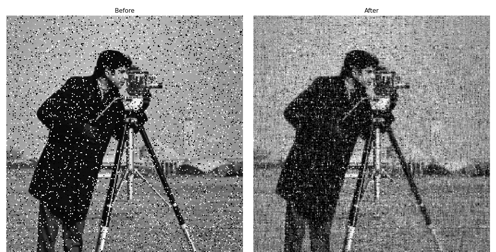
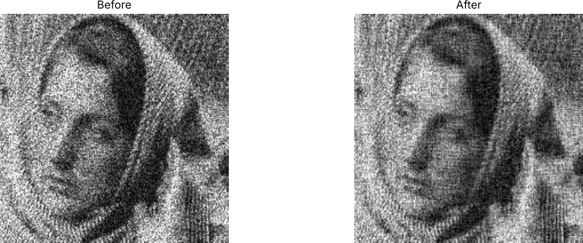

# Image Denoising with PCA

A Python script that reduces noise in a grayscale image using **Principal Component Analysis**. It rebuilds the image from its 50 strongest principal components and drops the rest. Most fine-grained noise lives in those weaker components, while the shapes and edges that make up the picture live in the strong ones.





## How it works

1. Load the image with Pillow and convert it to grayscale.
2. Treat the image as a matrix: each row of pixels is one sample, and each column is one feature.
3. Fit PCA (scikit-learn) and keep the top `num_components` components.
4. Project the rows onto those components and back again (`fit_transform` → `inverse_transform`). Detail that the kept components can't express, which is mostly noise, is lost.
5. Clip the pixel values back to 0–255 and show the original and the reconstruction side by side with Matplotlib.

`pca_denoise()` also takes `axis=1` to run PCA across columns instead of rows.

## Usage

```bash
git clone https://github.com/Saarthi09/Image-Denoiser.git
cd Image-Denoiser
pip install -r requirements.txt
python denoiser.py
```

When asked, enter an image file name. Paths are relative to the script's folder, so the bundled test images work as-is:

```
Enter file name: test_image_1.png
```

## Tuning

The trade-off is set by one number in `denoiser.py`:

```python
denoised_img = pca_denoise(img_array, num_components=50)
```

| Fewer components | More components |
|---|---|
| Stronger smoothing, more noise removed | Keeps more detail |
| Blurs fine detail | Lets more noise through |

## Limitations

PCA works best on noise that is spread evenly across the image, such as grain or Gaussian noise. With **salt-and-pepper** noise (the cameraman example), the isolated black and white pixels are smoothed into a faint texture rather than removed. A median filter is the usual tool for that kind of noise.

## Project structure

```
.
├── denoiser.py         # The script
├── test_image_1.png    # Noisy test images
├── test_image_2.png
├── docs/               # README images
├── requirements.txt
└── LICENSE
```

## Ideas for next steps

- Compare against a median filter and a Gaussian blur, and measure PSNR against a clean image
- Support colour images by denoising each channel
- Save the reconstructed image to a file
- A slider for picking the number of components interactively

## License

MIT, see [LICENSE](LICENSE).
